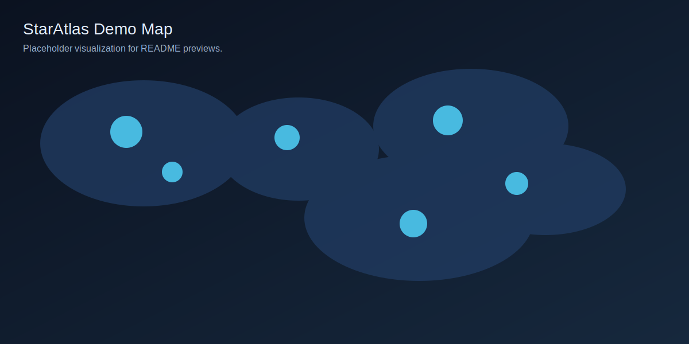

# StarryAtlas

StarryAtlas generates stargazer community visuals (world map) directly inside your GitHub Actions runner.

Location note: we only use `pycountry` to infer countries from user-provided profile locations. This is best-effort and will miss many city-only or informal locations. We intentionally avoid maintaining a custom location map or using paid geocoding APIs.

## Usage

```yaml
name: StarAtlas

on:
  schedule:
    - cron: "0 * * * *"
  workflow_dispatch: {}

permissions:
  contents: write

jobs:
  run:
    runs-on: ubuntu-latest
    steps:
      - uses: actions/checkout@v4
      - uses: astral-sh/setup-uv@v3
      - uses: supercoolpencil/starryatlas@v1
        with:
          output-dir: staratlas
          html: "true"
          theme: light
      - uses: stefanzweifel/git-auto-commit-action@v5
        with:
          commit_message: "chore(staratlas): update stargazer visuals"
          file_pattern: staratlas/*
```

## Embed


